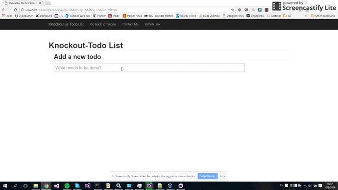

# Knockout-js-todolist
Knockout-js-todolist

The Github Repo of Multiple Sortable Todos using Knockout-js.

1. ##Tutorial##

	简体中文版本
	- [Building a Todo app with Knockout.js (1) - A simple todo list](http://kennethhutw.github.io/2016/10/05/Knockout-js-todo-list-sortable-cn-1/)
	- [Building a Todo app with Knockout.js (2) - Filter、Search and Sortable function](http://kennethhutw.github.io/2016/10/05/Knockout-js-todo-list-sortable-cn-2/)
	
	
	繁體中文版本
	- [Building a Todo app with Knockout.js (1) - A simple todo list](http://kennethhutw.github.io/2016/10/05/Knockout-js-todo-list-sortable-tw-1/)
	- [Building a Todo app with Knockout.js (2) - Filter、Search and Sortable function](http://kennethhutw.github.io/2016/10/05/Knockout-js-todo-list-sortable-tw-2/)
	
	
	English version
	- [Building a Todo app with Knockout.js (1) - A simple todo list](http://kennethhutw.github.io/2016/10/05/Knockout-js-todo-list-sortable-1/)
	- [Building a Todo app with Knockout.js (2) - Filter、Search and Sortable function](http://kennethhutw.github.io/2016/10/05/Knockout-js-todo-list-sortable-2/)

	
1. ##[Demo](http://kennethhutw.github.io/demo/KnockoutJs_todolist/Step2/index)
1. ##[Download](https://github.com/kennethhutw/Knockout-js-todolist/archive/master.zip)
1. ##[Practice](https://github.com/kennethhutw/Knockout-js-todolist/archive/practice.zip)

#Contact

1.[Website](http://www.kennethhu.net)
1.[Email](mailto:Kenneth.hu@hotmail.com)

#LICENSE

MIT